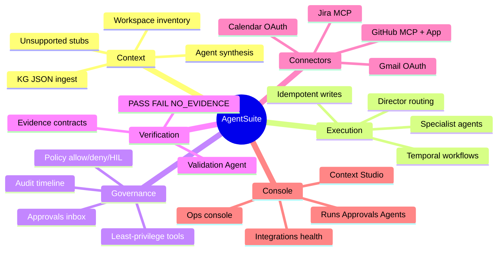
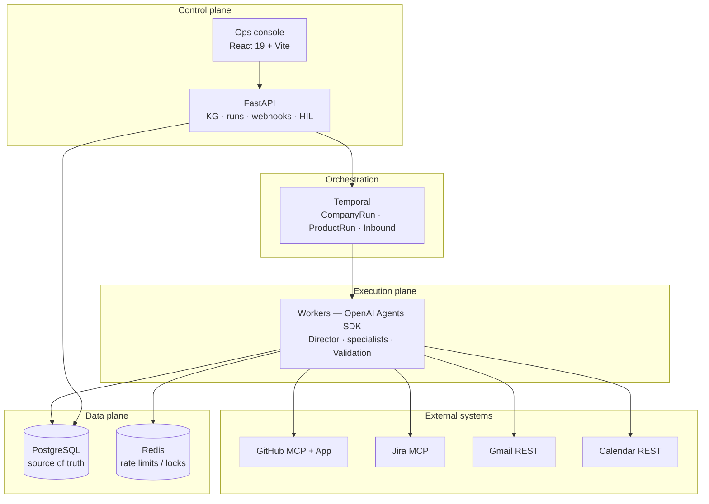
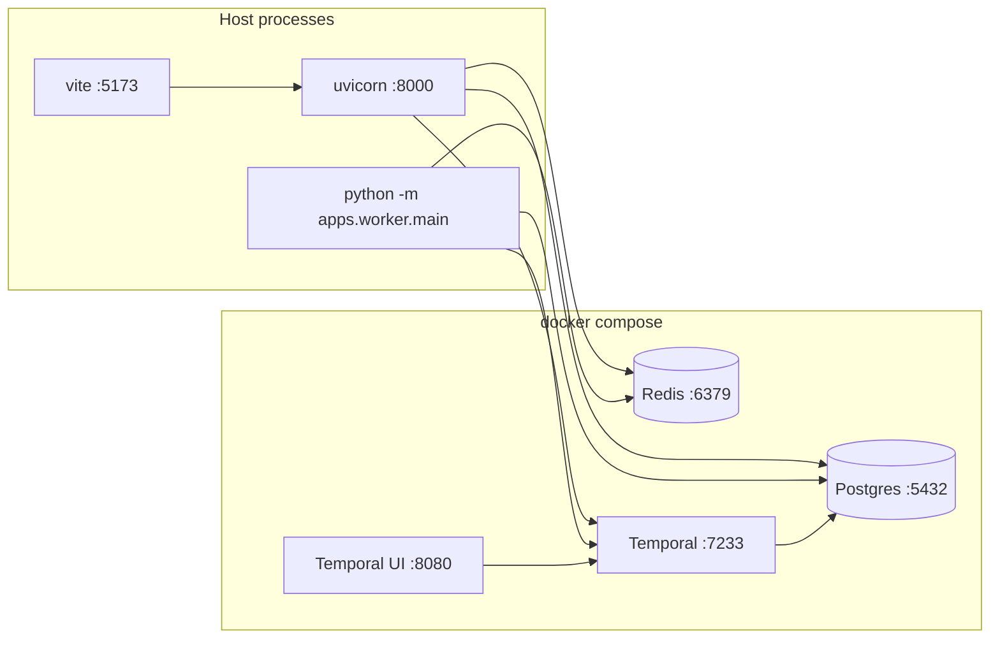
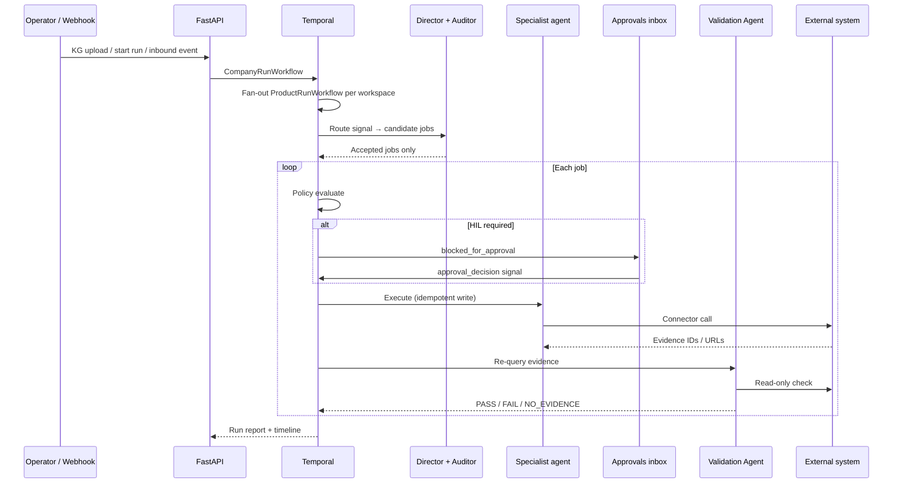

# AgentSuite

**Single-tenant, multi-product agentic automation** for engineering and ops teams.

Ingest a company knowledge graph → split into product workspaces → run specialized agents across **GitHub, Jira, Gmail, and Calendar**. Every write is **durable** (Temporal), **governed** (policy + human-in-the-loop), and **independently verified** (Validation Agent → `PASS` / `FAIL` / `NO_EVIDENCE`).

This is an **operations console**, not a chatbot. Agents are specialized executors; claims without machine-checkable evidence do not pass.

> Authority contract: [`AUTHORITY.md`](AUTHORITY.md) · Deep dives: [`docs/FEATURES.md`](docs/FEATURES.md) · [`docs/ARCHITECTURE.md`](docs/ARCHITECTURE.md) · [`docs/SETUP.md`](docs/SETUP.md)

---

## Why it exists

Companies run many products (payment gateway + customer portal, etc.), each with its own repos, boards, mail lists, and calendars. Manual ops — triage, PR reviews, customer replies, scheduling — does not scale.

Naive “LLM chatbot” approaches fail three ways:

| Failure | AgentSuite answer |
|---------|-------------------|
| Crash mid-run loses work | **Temporal** owns workflow state; replays from last completed step |
| Wrong repo / recipient | **Workspace scope + routing auditor + policy/HIL** |
| Agent claims success with no proof | **Evidence contracts + read-only Validation Agent** |

Land three words: **durable · governed · verifiable**.

---

## Capability map



---

## Architecture

### Three planes



| Plane | Role | Components |
|-------|------|------------|
| **Control** | Accept KG, start runs, serve status, webhook ingress | FastAPI, React ops console |
| **Execution** | Durable workflows, agent jobs, connector I/O | Temporal workers, OpenAI Agents SDK |
| **Data** | Source of truth + coordination | PostgreSQL (truth), Redis (rate limits — never run state) |

Writes never happen inside HTTP handlers. Webhooks enqueue Temporal work and return quickly.

### Technology stack

| Concern | Choice | Why |
|---------|--------|-----|
| Durability | **Temporal** (`temporalio`) | Retries, timeouts, HIL signals, crash-safe replay |
| API | **FastAPI** | Typed models, async, OpenAPI |
| Agent runtime | **OpenAI Agents SDK** | Tool-bound specialists, structured I/O |
| Persistence | **PostgreSQL 16** | Runs, jobs, approvals, policies, agents, audit |
| Coordination | **Redis 7** | Rate limits / optional locks — wipe-safe |
| GitHub / Jira | **MCP** (+ GitHub App for writes) | Tool surfaces + REST evidence helpers |
| Gmail / Calendar | **Native Google APIs** | OAuth refresh; Pub/Sub for inbound mail |
| Frontend | **React 19 + Vite + TypeScript** | Ops console (HttpAdapter → live API) |
| Domain | **`portable_core` (`aip.*`)** | Testable engine separate from deployables |

### Local infrastructure



| Service | Endpoint |
|---------|----------|
| Ops console | http://localhost:5173 |
| Control plane API | http://127.0.0.1:8000 · docs `/docs` |
| Temporal UI | http://localhost:8080 |
| Temporal gRPC | `localhost:7233` |
| Postgres | `localhost:5432` · `agentsuite` / `agentsuite` / `agentsuite` |
| Redis | `localhost:6379` |

Temporal uses separate DBs (`temporal`, `temporal_visibility`) on the same Postgres instance locally. App data stays in `agentsuite`.

---

## Core run lifecycle



1. **Context Studio** — paste/upload KG JSON → deterministic inventory + LLM agent synthesis → auditor → persist workspaces/agents.
2. **Company run** — `CompanyRunWorkflow` fans out `ProductRunWorkflow` per product workspace.
3. **Director** — selects a *small* set of specialists (sharing a connector ≠ co-activation).
4. **Routing auditor** — reject ungrounded / out-of-scope / unsupported routes before jobs exist.
5. **Execute + HIL** — policy may pause the workflow until human approve / deny / edit.
6. **Validate** — Validation Agent re-fetches external state; agent prose alone never PASSes.

---

## Features

### Knowledge graph → workspaces → agents

- **Company** — single tenant; owns credentials and policy defaults.
- **Product workspace** — scoped repos, Jira keys, email groups, calendars.
- **Agents** — specialized executors, idle until Director selects them.

KG systems without connectors (Slack, Notion, AWS, …) become **`unsupported` stubs** — visible, non-executable, no fake evidence.

Deterministic layer owns **facts and bounds**; LLM owns **meaning and capability**; auditor owns **groundedness**.

### Runnable agent specializations (v1)

| Agent | System | Typical jobs |
|-------|--------|--------------|
| **GitHub Issue Manager** | GitHub | Create / triage issues in repo scope |
| **GitHub PR Reviewer** | GitHub | Review comments on PRs |
| **GitHub CI/CD** | GitHub | Create/update workflow files (usually HIL) |
| **Jira Sync** | Jira | Create / transition tickets |
| **Gmail Comms** | Gmail | Send / reply (external send often HIL) |
| **Calendar Scheduler** | Calendar | Create / update events |
| **Validation** | Read-only | Re-fetch evidence → PASS / FAIL / NO_EVIDENCE |
| **Director** | Router only | Classify signals → structured plan; **no write tools** |

### Job types & evidence contracts

| Job type | Required evidence (minimum) |
|----------|-----------------------------|
| `github.create_issue` | `issue_url`, `repo`, `issue_number` |
| `github.review_pr` | `pr_url`, `review_id` or review URLs |
| `github.comment_issue` | `issue_url`, `comment_id`, `repo` |
| `github.create_or_update_workflow` | `repo`, `commit_sha`, `file_path`, `workflow_url` |
| `jira.create_ticket` | `issue_key`, `browse_url` |
| `jira.transition_ticket` | `issue_key`, `transition_id` (or changelog) |
| `gmail.send_email` | `message_id`, `thread_id` |
| `calendar.create_event` | `calendar_id`, `event_id` |
| `calendar.update_event` | `calendar_id`, `event_id` |

### Governance

- **Policy engine** — per-workspace allow / deny / require HIL; changeable at runtime.
- **HIL** — Temporal waits on `approval_decision` signal; Approvals inbox supports approve / deny / edit.
- **Least privilege** — tools ⊆ agent allowlist ⊆ available connectors ⊆ workspace scope.
- **Idempotency** — write keys from `run_id + workspace_id + job_type + requested_action`.
- **Anti-fake-data** — console does not seed synthetic runs/agents/validations.

### Inbound automation

| Source | Examples | Behavior |
|--------|----------|----------|
| **GitHub** | PR opened/sync, issue opened | Webhook → inbound workflow → company run |
| **Gmail** | Pub/Sub watch / simulate API | Reply to **original sender** (system mail filtered) |
| **Jira** | Issue / comment events | Director + structured or LLM plan |

Optional **cloudflared** tunnel from Integrations page for public webhook URLs.

### Ops console pages

| Page | Purpose |
|------|---------|
| **Ops console** | Live graph, agent workspace strip, Temporal timeline, health stats |
| **Context Studio** | KG ingest, parse preview, clear tenant state |
| **All projects** | Workspace list |
| **Overview / Runs** | Scope summary; company runs, job DAG, timeline |
| **Approvals** | HIL inbox with action preview |
| **Policies** | Per-action allow / HIL / deny |
| **Validation** | PASS / FAIL / NO_EVIDENCE + evidence refs |
| **Agents** | Catalog, specs, guardrails, metrics |
| **Integrations** | Connector health, last call, tunnel start/stop |

---

## Reliability & scale

| Pattern | How |
|---------|-----|
| Durable runs | Stable workflow ID `company-run-{uuid}`; crash → replay |
| Fast webhooks | Enqueue only; long I/O in Temporal activities |
| Bounded concurrency | Fan-out per company run; Redis rate limits per integration |
| Horizontal workers | Stateless processes on `agentsuite-main` task queue |
| Stateless API | Scale FastAPI replicas independently |
| Fail-closed routing | Auditor rejects before job rows exist |

Workers do not hold workflow state — Temporal does. Adding workers needs no state migration.

---

## Repository layout

```
agentsuite/
├── apps/
│   ├── api/                 # FastAPI control plane (routes, webhooks, tunnel)
│   └── worker/              # Temporal worker registration
├── portable_core/src/aip/   # Domain engine
│   ├── orchestration/       # Workflows + activities
│   ├── director/            # Router + routing auditor
│   ├── kg/                  # Inventory, synthesizer, persist
│   ├── jobs/                # Execute + validate registries
│   ├── policy/              # HIL / allow / deny
│   ├── evidence/            # Per-job-type contracts
│   ├── integrations/        # GitHub App, Gmail OAuth
│   ├── connectors/          # MCP clients, smoke
│   ├── tools/               # Gmail, Calendar native REST
│   ├── llm/                 # OpenAI-compatible client
│   └── runtime/             # Agents SDK adapter
├── frontend/                # Ops console (React)
├── infra/                   # Postgres init, Temporal dynamic config
├── scripts/                 # Health, smoke, OAuth helpers
├── demo/                    # Sample enterprise KG (do not auto-ingest)
└── docs/                    # Setup, features, architecture
```

**`portable_core`** is the execution engine. **`apps/`** are thin deployable entrypoints.

---

## Quick start

```bash
# 1. Infrastructure
docker compose up -d

# 2. Python (repo root)
cp .env.example .env          # fill secrets
pip install -e "./portable_core[dev]"
pip install -e ".[dev,agents]"

# 3. Frontend
cd frontend && cp .env.example .env && npm install && cd ..
# set VITE_API_MODE=http

# 4. Three processes
uvicorn apps.api.main:app --reload --host 127.0.0.1 --port 8000
python -m apps.worker.main
cd frontend && npm run dev
```

Verify infra: `python scripts/infra_health.py`

| Check | Command / URL |
|-------|----------------|
| Compose | `docker compose ps` |
| API health | http://127.0.0.1:8000/health |
| Console | http://localhost:5173/ops |
| Temporal | http://localhost:8080 |
| Tests | `python -m pytest portable_core/tests apps/api/tests -q` |

Full env catalog, OAuth, webhooks, and troubleshooting: [`docs/SETUP.md`](docs/SETUP.md).

---

## Documentation index

| Doc | Description |
|-----|-------------|
| [`AUTHORITY.md`](AUTHORITY.md) | Authoritative scope + architecture contract |
| [`docs/SETUP.md`](docs/SETUP.md) | Prerequisites, infra, env, local runbook |
| [`docs/FEATURES.md`](docs/FEATURES.md) | Agents, jobs, governance, inbound, console |
| [`docs/ARCHITECTURE.md`](docs/ARCHITECTURE.md) | Planes, reliability patterns, scaling |
| [`CONNECT.md`](CONNECT.md) | Connector smoke + webhook tunnel |
| [`infra/README.md`](infra/README.md) | Compose endpoints and Temporal DB notes |
| [`INTERVIEW_PREP.md`](INTERVIEW_PREP.md) | Pitch, whiteboard talking points |
| [`demo/README.md`](demo/README.md) | Sample Nexus Digital enterprise KG |

---

## Explicitly out of scope (v1)

- Multi-tenant SaaS isolation
- End-user chat UI
- Executable connectors beyond GitHub, Jira, Gmail, Calendar
- Fake success or mock evidence for unsupported systems

---

## License

Private / internal — see repository owner for terms.
